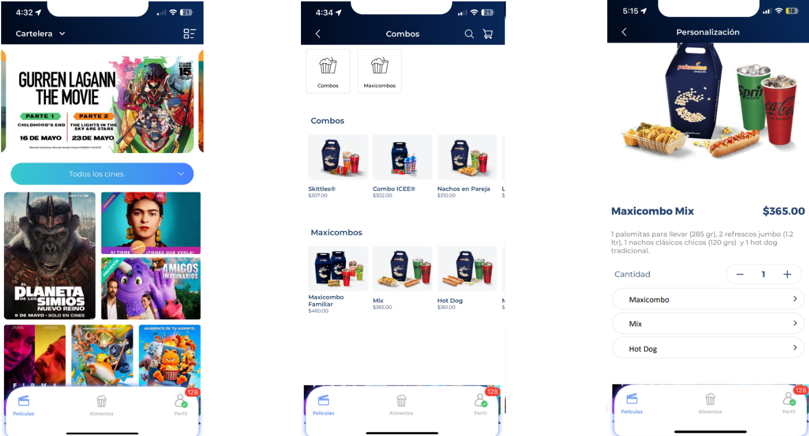
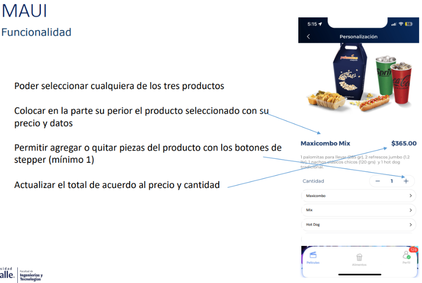
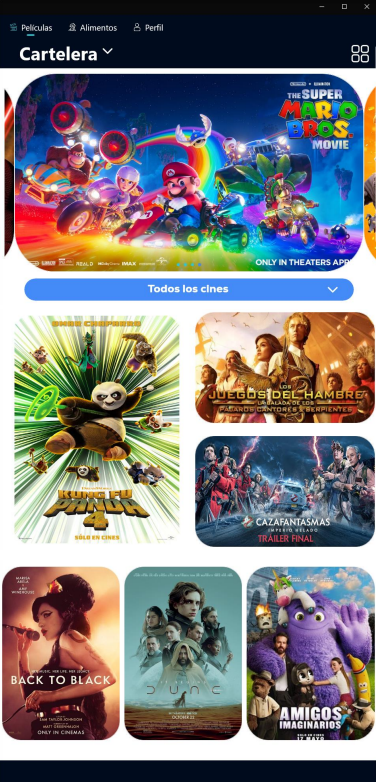
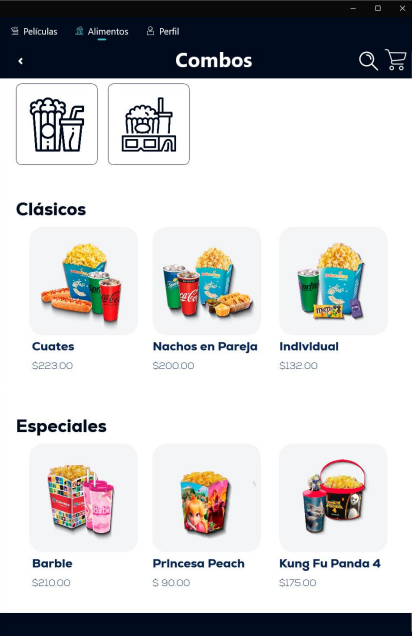
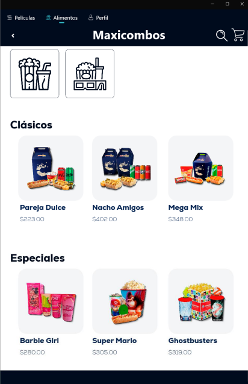
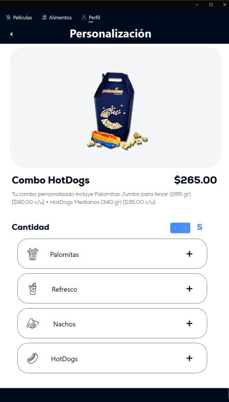

# app_cinepolis
Desarrollo de una aplicación móvil utilizando .NET Multi-platform App UI (.NET MAUI)
## VISTA
El objetivo principal es recrear una aplicación para un cine que permita a los usuarios ver las películas de estreno. Además, la aplicación incluirá un menú con opciones de combos y maxicombos, así como una sección donde los usuarios podrán personalizar sus propios combos.
El diseño proporcionado por el docente es el siguiente:

## FUNCIONALIDAD
La aplicación permitirá navegar entre paginas con un `TabbedPage`, todas las imágenes deben estar dentro de un `Frame`, además de contar con las siguientes especificaciones:

## Capturas de Pantalla
### **Películas**

    

### **Alimentos**

    

    

### **Personalización**

    

